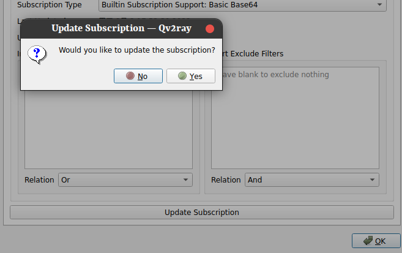

# v2ray

## 安装

1. 下载核心库
   1. github: https://github.com/v2ray/v2ray-core/releases
   2. ubutnu可以直接下载 https://github.com/v2ray/v2ray-core/releases/download/v4.28.2/v2ray-linux-64.zip

2. 下载图形化界面（这里使用Qv2ray）
   1. github: https://github.com/Qv2ray/Qv2ray
   2. ubutnu可直接下载 https://github.com/Qv2ray/Qv2ray/releases/download/v2.7.0/Qv2ray-v2.7.0-linux-x64.AppImage

## 配置

1. 首先将下载的核心库解压
2. 打开Qv2ray的appimage文件（需要chmod -x）
   1. 可以直接鼠标双击
   2. 或者命令行 ```./Qv2ray-v2.7.0-linux-x64.AppImage```

3. 配置核心库
   1. 在打开的图形化界面中左上方找到Preferences
   2. 在打开的Preferences的选项卡中点击Kernel Settings
   3. 在偏上方的位置找到 V2ray Core Executable Path
      1. 这里填写的是核心库core文件地址，核心库解压出来的文件夹第一层就能找到，文件名为v2ray
      2. 参考 ```/home/ran/DevelopTool/v2ray/v2ray-core/v2ray```
   4. 在偏上方的位置找到 V2ray Assets Directory
      1. 这里填写的是核心库地址，就是解压出来的文件夹路劲
      2. 参考```/home/ran/DevelopTool/v2ray/v2ray-core```
   5. 在中部位置找到 Check V2ray Core Settings并点击，如果没有出现Fail则配置成功
4. 配置订阅地址
   1. 返回图形化界面首页
   2. 在做上角点击Groups
   3. 在出现的设置界面中，可以在左边创建一个分组（也可以使用默认的）
   4. 在右侧选项卡找到Subsription Settings
   5. 在点击这个选项卡之后，第一行（Subsription Address）填入订阅链接
   6. 在第二行选择base64
   7. 点击下方的Update Subsription
   8. 
   9. 点击yes，如果什么都没提示则订阅成功，否则根据提示选择yes/no